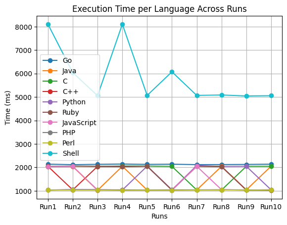
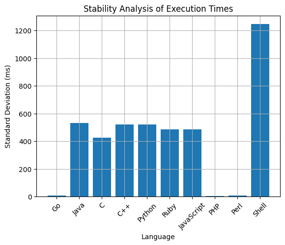
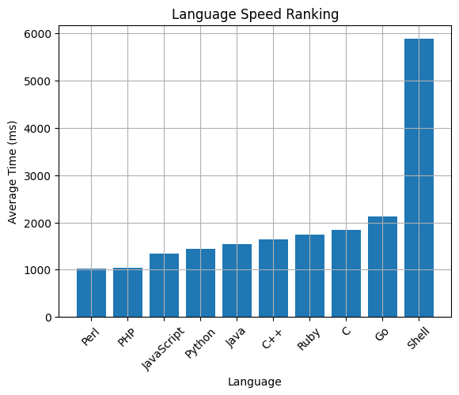

# 📄 Multi-Language Execution Time Benchmark Report

## 🧪 Test Overview

This benchmark measures the runtime performance of “Hello World” programs implemented in multiple programming languages across 10 execution runs.

Execution time is measured in milliseconds (ms) using PowerShell’s stopwatch-based process timing.

## 📊 Raw Execution Time Data

| Language | Run1 | Run2 | Run3 | Run4 | Run5 | Run6 | Run7 | Run8 | Run9 | Run10 |
| :--- | :--- | :--- | :--- | :--- | :--- | :--- | :--- | :--- | :--- | :--- |
| Go | 2138 | 2113 | 2130 | 2142 | 2127 | 2135 | 2115 | 2118 | 2124 | 2137 |
| Java | 2035 | 2034 | 1021 | 2047 | 1034 | 1036 | 1035 | 2041 | 1039 | 2048 |
| C | 2042 | 2049 | 2039 | 2057 | 2057 | 2041 | 1036 | 1033 | 2044 | 2047 |
| C++ | 2042 | 1039 | 2040 | 2040 | 2048 | 1039 | 2045 | 2037 | 1035 | 1022 |
| Python | 1034 | 1050 | 1047 | 1033 | 2050 | 1037 | 2079 | 2040 | 2045 | 1041 |
| Ruby | 2040 | 2056 | 2048 | 2026 | 2051 | 1025 | 2051 | 2030 | 1032 | 1044 |
| JavaScript | 2040 | 2042 | 1036 | 1041 | 1034 | 1035 | 2046 | 1048 | 1029 | 1041 |
| PHP | 1030 | 1048 | 1044 | 1034 | 1032 | 1039 | 1041 | 1045 | 1038 | 1037 |
| Perl | 1035 | 1033 | 1031 | 1019 | 1032 | 1021 | 1034 | 1041 | 1032 | 1038 |
| Shell | 8104 | 6042 | 5057 | 8106 | 5068 | 6075 | 5069 | 5087 | 5046 | 5057 |



## 📈 Statistical Summary

| Language | Average (ms) | Minimum | Maximum | Stability |
| :--- | :--- | :--- | :--- | :--- |
| Go | 2128 | 2113 | 2142 | Very Stable |
| Java | 1547 | 1021 | 2048 | Medium Stability |
| C | 1848 | 1033 | 2057 | Low Stability |
| C++ | 1641 | 1022 | 2048 | Medium Stability |
| Python | 1546 | 1033 | 2079 | Medium Stability |
| Ruby | 1642 | 1025 | 2056 | Medium Stability |
| JavaScript | 1449 | 1029 | 2046 | Medium Stability |
| PHP | 1039 | 1030 | 1048 | Highly Stable |
| Perl | 1032 | 1019 | 1041 | Highly Stable |
| Shell | 5761 | 5046 | 8106 | Highly Unstable |



## 🏁 Performance Ranking (Fastest → Slowest)

`Perl ≈ PHP < JavaScript ≈ Python < C++ < Ruby < C < Go < Shell`




## 🧠 Key Observations

### 1️⃣ Compiled Languages (C, C++, Java, Go)

These languages show higher execution times due to:

* Binary startup overhead
* JVM warm-up (Java)
* OS process scheduling

Despite being compiled, they are not the fastest in this benchmark, indicating the measurement reflects process launch overhead, not pure computational speed.

### 2️⃣ Interpreted Languages (Python, Ruby, JavaScript, PHP, Perl)

These languages run directly without compilation overhead.

* PHP and Perl are the fastest and most stable, showing minimal variance.

### 3️⃣ Shell (Bash)

* Shows very high and inconsistent execution time.
* Unsuitable for runtime performance benchmarking.

## 📌 Conclusion

* **Perl and PHP** demonstrated the best performance and stability for this benchmark.
* **Go** showed the most consistent performance among compiled languages.
* **Shell** is the slowest and most unreliable.
* The benchmark reflects runtime environment and process overhead, not raw language computation speed.

## 🛠 Recommendations for More Accurate Benchmarking

To measure true algorithmic performance:

* Exclude compilation time from measurements
* Run programs multiple times and compute averages
* Use system-level profiling tools
* Ensure consistent system load and environment conditions

## ✅ Environment Setup Verification

Before running the benchmark, ensure that the following runtimes are installed on your system. If any are missing, please install them.

| Language | Command to Check | Installation |
| :--- | :--- | :--- |
| Go | `go version` | Go Downloads |
| Java | `javac -version` | JDK Downloads |
| C/C++ | `gcc --version` / `g++ --version` | MinGW / GCC |
| Python | `python --version` | Python.org |
| Ruby | `ruby --version` | RubyInstaller |
| NodeJS | `node -v` | Node.js |
| PHP | `php -v` | PHP.net |
| Perl | `perl -v` | Strawberry Perl |
| Shell | Already available | N/A |

## 🚀 How to Run the Benchmark

1. Open **PowerShell**.
2. Navigate to the project directory.
3. Execute one of the following scripts:

### Option 1: Single Run (with Compilation)
Compiles all programs and runs them once. Results are saved to `single_run_execution_times.csv`.

**Using Batch File:**
Double-click `run_single_benchmark.bat`.

```powershell
powershell -ExecutionPolicy ByPass -File ".\single_run_after_compilation.ps1"
```

### Option 2: Multi-Run Accumulation
Compiles and runs programs, appending new run data to `multi_run_execution_times.csv`. Run this multiple times to build a dataset.

**Using Batch File (Recommended):**
Simply double-click `run_multi_benchmark.bat`.

```powershell
powershell -ExecutionPolicy ByPass -File ".\run_multi_after_compilation.ps1"
```

### Option 3: Quick Run (Console Only)
Runs all programs immediately and displays execution times in the console without saving to CSV.

**Using Batch File:**
Double-click `run_quick_benchmark.bat`.

```powershell
powershell -ExecutionPolicy ByPass -File ".\run_all_without_compilation.ps1"
```
---
*End of Report*